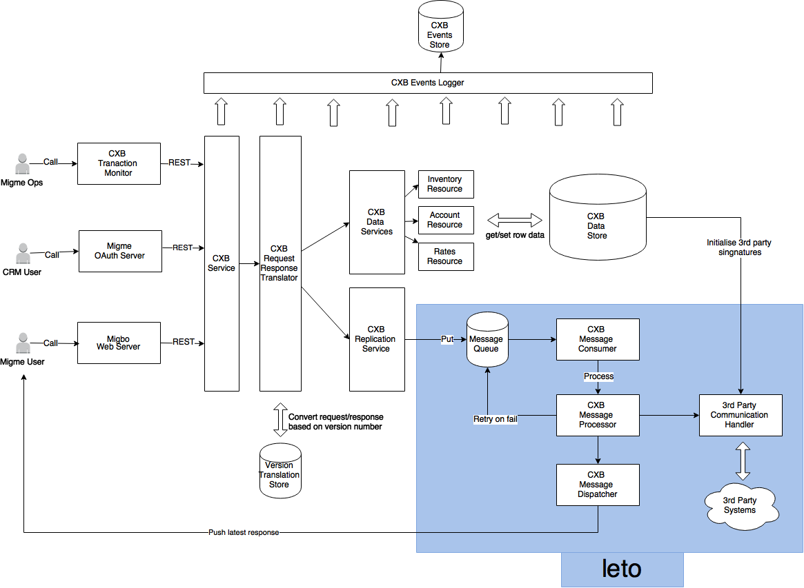

# Credit Exchange
Migme credit exchange services

## Sub Modules/Folders
- common : Submodule to put all the sharable credit-exchange specific codes between each submodule
- dataservice : Submodule for direct CRUD operations on metadata
- replicationservice : Submodile for replication services such as purchasing, gifting and etc...
- web : Submodule to expose all dataservice and replicationservice endpoints over http (REST)
- deployment : Subfolder to keep all the scripts required for deployment

## Design

